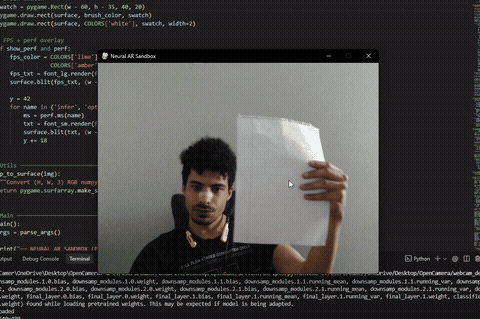
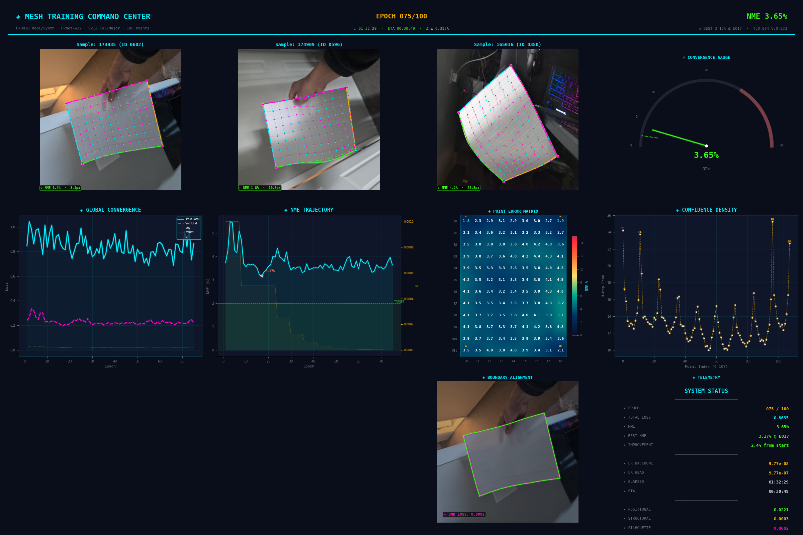

# Neural AR Physics Sandbox

A real-time AR physics sandbox. It uses a custom HRNet mesh regressor to detect a physical piece of paper via webcam, projects shapes using piecewise-affine warping, transfers real-world lighting and shadows, and runs a physical simulation with tilt-based gravity derived from the paper's pose.

## Features
- **Real-Time Mesh Tracking**: Uses HRNet to regress 108 structural points for curved projection mapping.
- **Topological Gravity**: PyMunk physics engine derives directional gravity from the paper's 3D tilt.
- **Lighting Transfer**: Uses live occlusion matting and specular highlight tracking to blend virtual objects with real-world shadows.
- **High Performance**: FP16 inference, bounding box isolation, and multithreaded 1-Euro temporal filtering for 60+ FPS.

---

## Installation

Requires Python 3.9+ and a CUDA-compatible GPU for real-time tracking (CPU fallback supported).

**Training Visualizer (Dashboard Example):**

